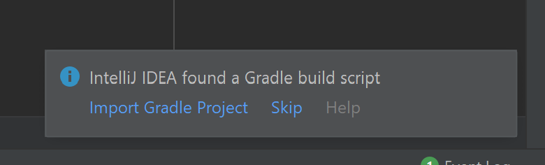
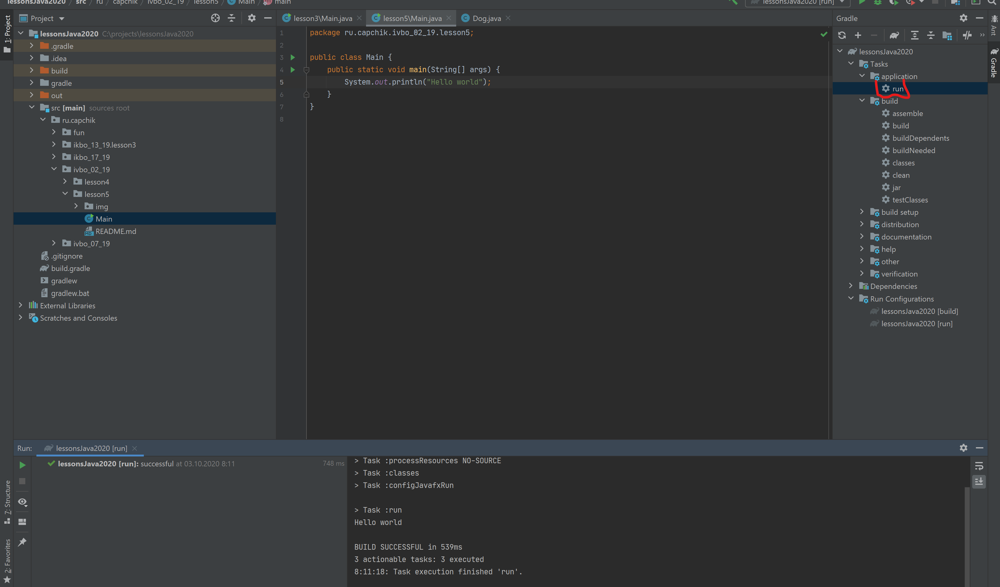

# Начало работы с JavaFX

## 1. Преобразовать проект к Gradle проекту.

Сейчас проект в Intellij IDEA является стандартным Java проектом.

Для удобного добавления JavaFX как зависимости к проекту необходимо начать использовать систему сборки Gradle. Для этого создайте в корне вашего Java проекта файл `build.gradle` cо следующим содержимым:

```groovy
plugins {
    id 'java' // Для поддержки старого кода
    id 'application' // Для запуска JavaFX
    id 'org.openjfx.javafxplugin' version '0.0.8' // Зависимость на JavaFX
}

group 'oru.capchik' // Базовый package вашего проекта
version '1.0-SNAPSHOT'

repositories {
    mavenCentral() // Откуда будут браться зависимости
}
sourceSets {
    main {
        java {
            srcDirs = ['src'] // Указание папки с исходными файлами
        }
    }
}

javafx {
    version = "14"
    modules = [ 'javafx.controls' ] // Какие модули берутся из зависимости
}
mainClassName='ru.capchik.ivbo_02_19.lesson5.Main' // Указать название файла, который будет запускаться
```

После создания такого файла необходимо перезапустить IDE.

Появится следующее изображение:

Необходимо нажать на `Import Gradle Project`.

После индексирования, в правой части появится вкладка Gradle, где необходимо найти папку заданий `application`, и дважды нажать на `run`. Эта команда соберет весь исходный код, и выполнит main метод из указанного класса в файле build.gradle.



В нижней части можно видеть, как вывелся результат.

Старые исходники все еще можно запускать при помощи зеленой стрелки около метода `main`, но JavaFX приложения необходимо запускать через `application->run`, так как они требуют зависимости.

Для того, чтобы ничего лишнего не коммитить - необходимо добавить содержимое [данного](https://github.com/github/gitignore/blob/master/Gradle.gitignore) файла, в ваш .gitignore, который должен лежать в корне проекта. Если такового нет - создайте.